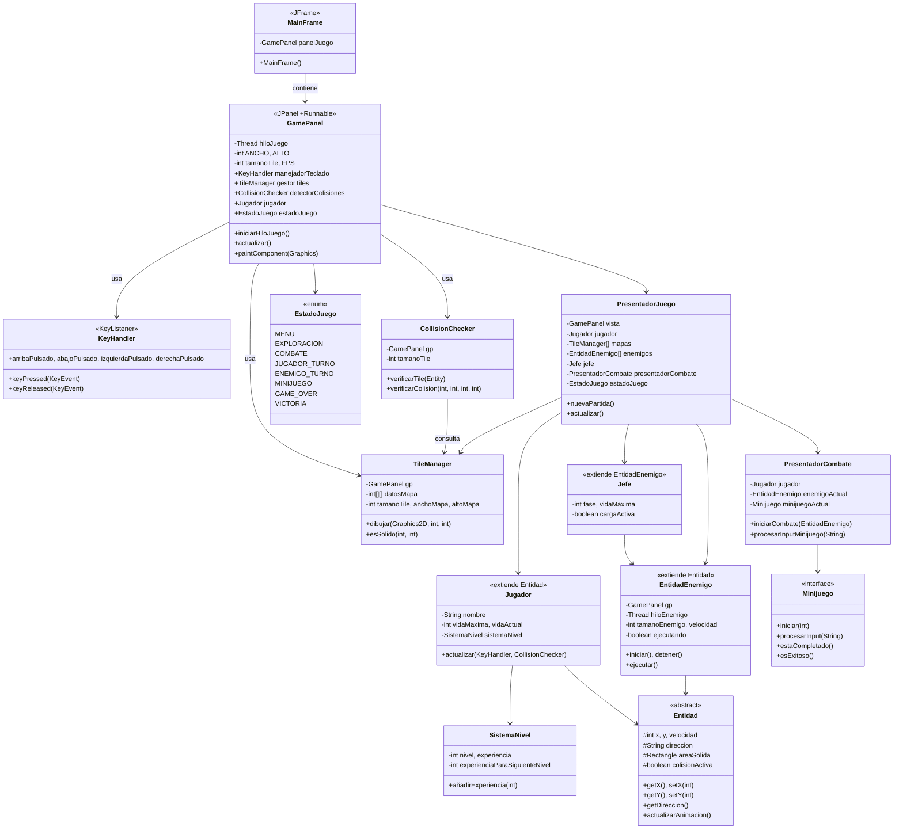

# iLERNTALE - Diseño técnico

## UML de Clases



---

## GamePanel (JPanel)

GamePanel es el panel donde se renderiza todo el juego. Implementa Runnable para ejecutar el game loop en un thread separado.

```java
public class GamePanel extends JPanel implements Runnable {

    public static final int WIDTH = 800;
    public static final int HEIGHT = 600;

    public final int originalTileSize = 48;
    public final int scale = 4;
    public final int tileSize = originalTileSize * scale;

    private Thread gameThread;
    private boolean running;
    private final int FPS = 60;

    public KeyHandler keyH = new KeyHandler();
    public TileManager tileM = new TileManager(this);
    public CollisionChecker cChecker = new CollisionChecker(this);
    public Jugador jugador = new Jugador("Migue");

    public EstadoJuego gameState = EstadoJuego.EXPLORACION;

    public GamePanel() {
        setPreferredSize(new Dimension(WIDTH, HEIGHT));
        setBackground(Color.BLACK);
        setDoubleBuffered(true);
        setFocusable(true);
        addKeyListener(keyH);
    }

    public void startGameThread() {
        gameThread = new Thread(this);
        running = true;
        gameThread.start();
    }

    @Override
    public void run() {
        double drawInterval = 1000000000.0 / FPS;
        double delta = 0;
        long lastTime = System.nanoTime();

        while (gameThread != null && running) {
            long currentTime = System.nanoTime();
            delta += (currentTime - lastTime) / drawInterval;
            lastTime = currentTime;

            if (delta >= 1) {
                update();
                delta--;
            }

            repaint();
        }
    }

    private void update() {
        if (gameState == EstadoJuego.EXPLORACION) {
            jugador.update(keyH, cChecker);
        }
    }

    @Override
    protected void paintComponent(Graphics g) {
        super.paintComponent(g);
        Graphics2D g2 = (Graphics2D) g;

        g2.setRenderingHint(RenderingHints.KEY_ANTIALIASING, RenderingHints.VALUE_ANTIALIAS_OFF);
        g2.setRenderingHint(RenderingHints.KEY_INTERPOLATION, RenderingHints.VALUE_INTERPOLATION_NEAREST_NEIGHBOR);
        g2.setRenderingHint(RenderingHints.KEY_TEXT_ANTIALIASING, RenderingHints.VALUE_TEXT_ANTIALIAS_OFF);
        g2.setRenderingHint(RenderingHints.KEY_RENDERING, RenderingHints.VALUE_RENDER_SPEED);

        if (gameState == EstadoJuego.EXPLORACION) {
            tileM.draw(g2);

            BufferedImage image = ResourceManager.getPlayerSprite(
                    jugador.getNombre(),
                    jugador.getDireccion(),
                    jugador.getSpriteNum());

            if (image != null) {
                g2.drawImage(image, jugador.getX(), jugador.getY(), tileSize, tileSize, null);
            }
        }

        if (gameState == EstadoJuego.MENU) {
            // Dibujar menú
        }

        g2.dispose();
    }
}
```

---

## Puntos clave

1. **MainFrame** solo crea la ventana y arranca el game thread
2. **GamePanel** maneja todo el renderizado y la lógica
3. **Game loop** usa delta time para mantener 60 FPS constantes
4. **Doble buffer** activado para evitar parpadeo
5. **Thread separado** para no bloquear el EDT de Swing
