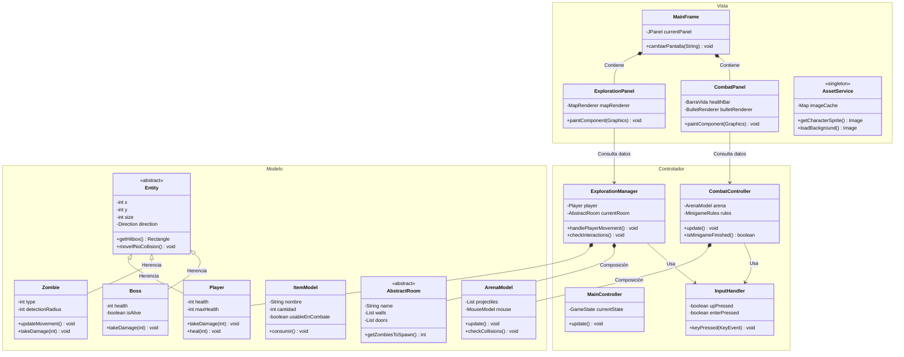

# iLERNTALE - Ingeniería Directa (RA5.d)

Este documento define la arquitectura técnica del videojuego **iLERNTALE**, estructurada bajo el patrón de diseño **Modelo-Vista-Controlador (MVC)** para garantizar una separación de responsabilidades clara, escalabilidad y facilidad de mantenimiento.

## 1. Diagrama de Clases (MVC)

El siguiente diagrama representa las entidades, interfaces de usuario y controladores, así como sus relaciones fundamentales.

## 2. Definición de Responsabilidades

Siguiendo el principio de **Responsabilidad Única (SRP)**, el sistema se divide de la siguiente manera:

### A. Modelo (Model)
Contiene la lógica de negocio y los datos puros. No conoce la interfaz gráfica.
*   **Entity / Player / Zombie**: Gestionan sus propios atributos (vida, posición) y reglas internas (recibir daño, cálculo de colisiones).
*   **ArenaModel**: Mantiene el estado físico del combate (posiciones de proyectiles y colisiones detectadas).
*   **ItemModel**: Define las propiedades de los objetos y su lógica de consumo.

### B. Vista (View)
Se encarga exclusivamente de la representación visual del Modelo.
*   **MainFrame**: El contenedor principal que orquestra el cambio entre paneles (Pantalla de Selección, Exploración, Combate).
*   **Panels (Combat/Exploration)**: Interpretan los datos del controlador para dibujarlos mediante `Graphics2D`.
*   **AssetService**: Centraliza la carga de recursos (imágenes, sonidos) para evitar redundancia en memoria.

### C. Controlador (Controller)
Actúa como puente entre el Modelo y la Vista, gestionando el flujo del juego.
*   **MainController**: Controla el ciclo de vida del juego (estados, pausas, transiciones).
*   **ExplorationManager / CombatController**: Traducen las entradas del usuario (`InputHandler`) en cambios del estado del Modelo y coordinan la lógica temporal (frames, actualizaciones).
*   **InputHandler**: Captura los eventos de hardware (teclado/ratón) y los expone de forma desacoplada.

## 3. Beneficios del Diseño
1.  **Ingeniería Directa / Inversa**: La estructura modular permite mapear directamente estas clases con los archivos `.java`, facilitando la actualización del diagrama si el código cambia.
2.  **Desacoplamiento**: Es posible cambiar el motor gráfico (Vista) sin alterar la lógica de los personajes (Modelo).
3.  **Testeo**: La lógica del Modelo puede probarse mediante tests unitarios sin necesidad de levantar una interfaz gráfica.
